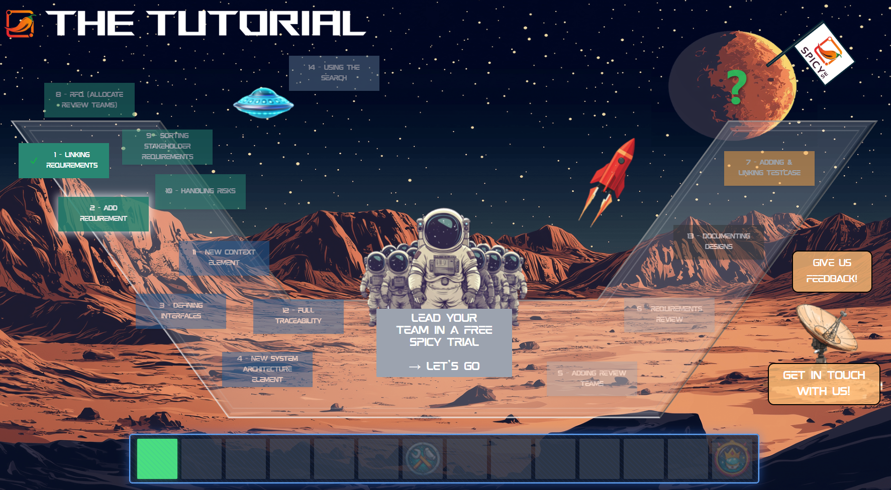
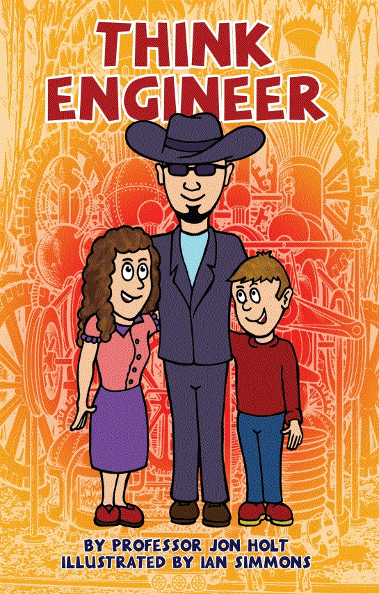

## Attendees

-   [x] [Walden, Dave](mailto:dave@sysnovation.com)
-   [x] [Hämisch, Robert](robert@spicy-se.com)
-   [x] [Solorzano Zeledon, Esteban](mailto:Esteban.SolorzanoZeledon@bsci.com)

## Agenda

-   Quick calibration of content scope for presentation Medical Device Systems Engineer Role Playing Game (RPG): The Device of Life

## Minutes

-   [Hämisch, Robert](robert@spicy-se.com) would like to explore attending the INCOSE Healthcare conference. [Hämisch, Robert](robert@spicy-se.com) tried reaching out to [Unger, Chris](mailto:christopher.unger@incose.net) via email (christopher.unger\@incose.net) to inform about attending the INCOSE Healthcare conference, explain that Spicy SE is a startup, possibility of putting a stand.

-   [Solorzano Zeledon, Esteban](mailto:Esteban.SolorzanoZeledon@bsci.com) would like to include two slides showing how Spicy SE uses gamification to explain their products to customers.

-   Examples of gamification in systems engineering

    -   SpicySE The Tutorial, URL: <https://tutorial.spicy-se.com/launchpad>

-  Presentation title will be renamed to "Game On! Attracting Everyone to Systems Engineers through Gamification"

## Tasks

-   [ ] [Hämisch, Robert](robert@spicy-se.com) to send Spicy SE game cards to [Solorzano Zeledon, Esteban](mailto:Esteban.SolorzanoZeledon@bsci.com) when possible.
-   [ ] [Walden, Dave](mailto:dave@sysnovation.com) will contact [Unger, Chris](mailto:christopher.unger@incose.net) to ask about what opportunities are for [Hämisch, Robert](robert@spicy-se.com) to be a sponsor. [Hämisch, Robert](robert@spicy-se.com) needs to know the costs of being the sponsor and what are the sponsor packages.
-   [ ] [Solorzano Zeledon, Esteban](mailto:Esteban.SolorzanoZeledon@bsci.com) will ensure that presentation stays within 20min to allow 10min for Q&A.

## Gamification context

Since prehistoric times, man has used play as a means to learn survival skills. Young children emulate what their parents do through play.

In the current age, you see kids role-playing being an investor (game Monopoly), role-playing being a doctor, astronaut, chef.

It would be great for kids and adults to be able to get familiar with systems engineering through play, just as other careers.

Examples of games that could be leveraged to teach systems engineering include:

-   **Factorio:** Popular for its deep production chains and optimization challenges. URL: <https://www.factorio.com/>
-   **Satisfactory:** A 3D version of Factorio with a first-person perspective, focusing on manufacturing and process flow. URL: <https://www.satisfactorygame.com/>
-   **Terraforming Mars**: A game where players work to develop Mars into a habitable planet. This game involves project management, resource allocation, and long-term planning. URL: <https://fryxgames.se/product/terraforming-mars/>

**References:**

-   Gee, J. P. (2003). What Video Games Have to Teach Us About Learning and Literacy. Palgrave Macmillan.

-   Squire, K. (2011). Video Games and Learning: Teaching and Participatory Culture in the Digital Age. Teachers College Press.

-   Gamification of incentives and mechanism design in systems engineering,<https://ieeexplore.ieee.org/document/7490587>

-   How can Systems Engineering be improved using Gamification?, <https://louis.uah.edu/cgi/viewcontent.cgi?article=1163&context=vbs-posters>

-   Gamification in university teaching for Systems Engineering students at a Lima North University, <https://ieeexplore.ieee.org/abstract/document/9149524>

-   System dynamics gamification: A proposal for shared principles, <https://onlinelibrary.wiley.com/doi/full/10.1002/sres.2805>

-   Using video games to teach engineering concepts, <https://www.youtube.com/watch?v=Exlym1oTaMM>

**Other resources that complement:**

The Engineer in the Hat, URL: <https://incoseuk.org/Normal_Files/Outreach/Think_Engineer>

{width="255"}

